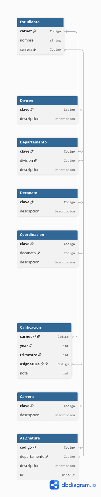

# USB DB - Simulación para el exámen: tarea de Bases de Datos

Cuenta la leyenda que en el año 2042 hubo un cambio radical en la enseñanza.
Las universidades se adaptaron a la era de inteligencia artificial avanzada.
Robots y computadoras se han vuelto mucho más inteligented que nosotros.
Las máquinas deciden que deben preservar el (inferior) intelecto humano.
Por esa razón preservan la enseñanza. La USB es parte de la iniciativa.

En este nuevo mundo:

- Los estudiantes nunca raspan materias
- El implante neuronal hace que mejoren si tienen problemas
- Pero tambien alienta a los estudianteas a esforzarse
- Esto los obliga a pensar y desarrollar su intelecto
- Las notas van de 3 a 5

La estructura y funcionamiento de la USB corresponde al año 2019.
El repositorio contiene el catálogo de la USB, para que lo vean.
No pierdan tiempo estudiandolo: lo necesario esta en el código.

## Cómo usar el programa

Simplemente ejecútenlo sin argumentos. Verán este menu interactivo.

0 - reset
1 - divisiones
2 - departamentos
3 - asignaturas
4 - decanatos
5 - coordinaciones
6 - carreras
7 - estudiantes
8 - calificaciones
> - avanza
x - extend
t - todos
q0 - query 0
q1 - query 1
q2 - query 2
q3 - query 3
. - salir
<USB DB>

La última línea "<USB DB> " es el prompt para que seleccionen un comando.
Simplemente dénle a la tecla del número 1 y luego al Enter

    <USB DB> 1

Verán la lista de las Divisiones de la universidad:las mismas del catálogo!
Repitan lo anterior para los números (entidades) del 2 al 6.
Noten los valores y campos de las tablas. Por ejemplo:

    { codigo: MA1111, departamento: MA, descripcion: Matemáticas I, uc: 4 }

Es uno de los "records" en la Tabla de Asignaturas, y se interpreta asi:
"MA1111" es una asignatura (Materia) del departamento "MA" (Matemáticas)
El título (descripcion) del curso es "Matemáticas I" y ..
.. vale 4 unidades de credito.

Al intentar con 7 y 8 (estudiantes y calificaciones) verán que no tienen nada.
La universidad acaba de "re-inventarse" y aun no ha comenzado.

El comando '>' (mayor que) hace que la universidad avance un año.
Nuevos estudiantes se registran. Los que ya están, avanzan al año siguiente.
Vuelvan a intentar el 7 y el 8 - verán que ahora tienen estudiantes y notas.

El comando 'x' permite eXtender las simulación por varios años hacia el futuro.
Tiene una sintaxis especial, de la forma x:<N>, donde <N> es un valor entero.
Por ejemplo:

    x:8

Avanza 8 años: 'x:8' es equivalente a usar '>' 8 veces.
No usen valores de N mayores que 20: ¡la base de datos crece rapidamente!
Su computadora (y su tiempo) lo van a apreciar.

Los comandos 'q0' a 'q3' van a ejecutar los queries que Uds. deben implementar.

Por último, olvidense del comando '0' (reset) y 't' (todos) .. no importan aqui.

## Reglas para la tarea

- No deben cambiar el codigo provisto en la tarea, excepto por Query.cxx
- Query.cxx es el archivo donde van a implementar los "queries" del examen.
- Ademas, sólo pueden llamar a funciones declaradas en los encabezados (*.h) ..
- .. excepto en los pocos casos donde el encabezado lo prohibe. Por ejemplo:

    // OJO: NO deben usar las funciones declaradas de aqui al final del archivo

- En caso de conseguir "bugs" en la tarea, reportenlos.
- Lean todo concuidado y no vacilen preguntar.

## Estructura de la base de datos

A manera de diagrama, la estructura de la base de datos es la siguiente:




En ella vemos que nuestra base de datos se conforma de las tablas:

- Carrera: cuya clave primaria (pk) es el codigo de la carrera.
- Division: cuya pk es el codigo de la division.
- Decanato: cuya pk es el codigo del decanato.
- Estudiante: cuya pk es su carnet, y posee una clave foranea (fk) que
  referencia a su carrera.
- Departamento: cuya pk es el codigo del departamento, y posee una fk que
  referencia al decanato al que pertenece.
- Coordinacion: cuya pk es el codigo de la coordinacion, y posee una fk que
  referencia al departamento al decanato que pertenece.
- Calificacion: el cual es un expediente academico que asocia a cada carnet
  de cada estudiante con una asignatura que curso en un an~io y trimestre determinado.
- Asignatura: cuya pk es el codigo de la asignatura, y posee una fk que
  referencia al departamento que pertenece.

Es importante mencionar que la clave primaria de calificacion es una clave compuesta
del carnet, el an~io, el trimestre y el codigo de la asignatura. Y que
el anio se refiere al an~io en que el estudiante curso la asignatura, es decir: 2042,
2043, etc.

## Estructura de los archivos

Ustedes solo necesitan ver los archivos con extension .h, ya que estos
les muestran la interfaz (funciones) que tienen disponible. No necesitan
leer las implementaciones .cxx de las mismas.

En particular, las tablas se veran de la siguiente manera:

```cxx
class Estudiante {
public:
    Estudiante(Codigo carnet, std::string nombre, Codigo carrera);

    std::string str() const;
    std::string json() const;

    Codigo carnet() const;
    std::string nombre() const;
    Codigo carrera() const;
    int year() const;

    bool activo() const;
    bool graduado() const;

    static const std::vector<Estudiante>& tabla();

    // OJO: NO deben usar las funciones declaradas de aqui al final del archivo
    static int new_academic_year();
    static int into_the_future(int n);

    void update_academic_record();

private:
    Codigo carnet_;
    std::string nombre_;
    Codigo carrera_;
    int year_;
};
```
En ella, a ustedes les interesa:

- carnet(): para obtener el carnet del estudiante
- nombre(): para obtener el nombre del estudiante
- carrera(): para obtener el codigo de la carrera del estudiante
- year(): para obtener el an~io academico actual del estudiante
- activo(): para saber si el estudiante sigue activo
- graduado(): para saber si el estudiante ya se graduo
- tabla(): para obtener la tabla completa de estudiantes.

Noten que todos los tipos de retornos son o vectores (tablas) o tipos basicos.

## Tarea 1

Utilizando algebra relacional (como la vista en clase de laboratorio). Impllementen los siguientes queries:


- Query 0: Para el anio academico 2044, obtener el indice academico promedio de la carrera Ingenieria Electronica.
- Query 1: La cantidad de estudiantes graduados de computacion y electronica para el an~io academico 2050.
- Query 2: Las asignaturas del departamento de computacion.
- Query 3: Los estudiantes activos que cursaron Matematicas VII y pasaron Fisica I con nota mayor o igual a 4.
- Query 4: La cantidad de unidades de credito (uc)
  aprobadas por los estudiantes activos de la carrera de Ingenieria Electronica
  hasta el anio academico 2046 los cuales tomaron el curso de Matematicas IV.

## Tarea 2

Implemente los queries de la Tarea 1 utilizando C++ dentro del archivo Query.cxx.

- Para el query 0, el resultado DEBE de ser de tipo flotante.
- Para el query 1, el resultado DEBE de ser de tipo entero.
- Para el query 2, el resultado DEBE de ser un vector de Asignatura.
- Para el query 3, el resultado DEBE de ser un vector de Estudiante.
- Para el query 4, el resultado DEBE de ser un vector de tuplas
  donde cada tupla contiene el carnet del estudiante y la cantidad de unidades de credito aprobadas.

NO se corregiran queries que no cumplan con los tipos indicados.
